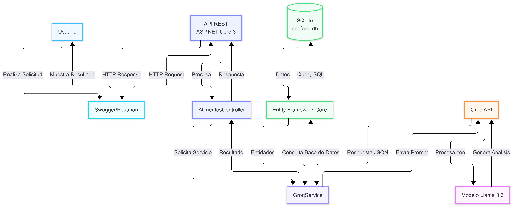

# EcoFood API

## Proyecto Final – Diplomado en Desarrollo .NET

---

# Presentación del Proyecto

## Integrantes

- Jesús Antonio De La Hoz Piñeres
- Sergio Andres Bravo Duran

---

# Descripción del proyecto

EcoFood API es una API REST desarrollada en ASP.NET Core 8 cuyo propósito es contribuir a la reducción del desperdicio de alimentos mediante la administración de una despensa inteligente y el uso de inteligencia artificial para generar recetas con los ingredientes disponibles.

El proyecto está alineado con el Objetivo de Desarrollo Sostenible (ODS) 12: **Producción y Consumo Responsable**, promoviendo el aprovechamiento eficiente de los alimentos y reduciendo las pérdidas ocasionadas por vencimiento o falta de planificación.

---

# Objetivo

Desarrollar una API REST que permita administrar una despensa de alimentos mediante operaciones CRUD, realizar consultas sobre los productos almacenados y utilizar inteligencia artificial para sugerir recetas a partir de los ingredientes disponibles.

---

# Tecnologías utilizadas

- ASP.NET Core 8
- C#
- Entity Framework Core
- SQLite
- Swagger / OpenAPI
- API Groq
- Modelo Llama 3.3

---

# Arquitectura General

La siguiente figura muestra la arquitectura general del sistema y la interacción entre sus componentes.

**Descripción del flujo**

1. El usuario realiza una solicitud desde Swagger o Postman.
2. La API REST recibe la petición y la direcciona al controlador correspondiente.
3. Para operaciones CRUD, el controlador utiliza Entity Framework Core para acceder a la base de datos SQLite.
4. Cuando se solicita analizar una receta, el controlador invoca el servicio `GroqService`.
5. `GroqService` construye el prompt y realiza una solicitud HTTP a la API de Groq.
6. El modelo Llama 3.3 procesa la información y devuelve una respuesta en formato JSON.
7. La API procesa la respuesta y la retorna al cliente.

---

# Funcionalidades principales

- Registrar alimentos.
- Consultar alimentos.
- Actualizar alimentos.
- Eliminar alimentos.
- Buscar alimentos.
- Consultar alimentos próximos a vencer.
- Consultar estadísticas de la despensa.
- Generar recetas mediante Inteligencia Artificial.

---

# Integración con Inteligencia Artificial

El proyecto utiliza la API de Groq para conectarse con el modelo **llama-3.3-70b-versatile**, el cual analiza los ingredientes disponibles y genera una receta en formato JSON.

En caso de que el servicio no esté disponible, la API devuelve una respuesta de respaldo para garantizar la continuidad del servicio.

---

# Conclusiones

EcoFood API demuestra la integración de tecnologías modernas para el desarrollo de APIs REST utilizando ASP.NET Core, Entity Framework Core y SQLite, incorporando además inteligencia artificial para ofrecer una solución práctica orientada a disminuir el desperdicio de alimentos y apoyar la toma de decisiones en el consumo responsable.