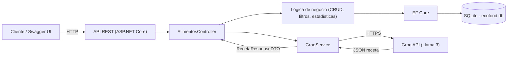

# Taller de Avance — Proyecto Final Módulo 4

## Nombre del proyecto
**EcoFood API**

## ODS relacionado
**ODS 12 — Producción y consumo responsables**

## 1. Definición del problema

Muchas personas compran alimentos que terminan venciéndose porque no llevan un control organizado de lo que tienen en su despensa, generando desperdicio de comida y pérdida económica. Los beneficiarios son hogares y familias que buscan reducir el desperdicio alimenticio y aprovechar mejor sus compras. EcoFood API ayuda permitiendo registrar los alimentos con su fecha de vencimiento, alertando sobre los que están próximos a caducar y sugiriendo, mediante IA, recetas que aprovechen lo que ya está disponible antes de que se dañe. Esto se relaciona directamente con el ODS 12, al fomentar patrones de consumo más responsables y reducir el desperdicio de alimentos a nivel doméstico.

*(148 palabras)*

## 2. Funcionalidad general

**Nuestra API permitirá** registrar los alimentos de la despensa de un usuario, controlar sus fechas de vencimiento, consultar cuáles están próximos a caducar, eliminar los productos ya consumidos, buscar alimentos por nombre o categoría, obtener estadísticas generales de la despensa, y sugerir recetas mediante inteligencia artificial a partir de los productos disponibles.

| # | Módulo | Funcionalidad |
|---|--------|---------------|
| 1 | Alimentos | Registrar un nuevo alimento con nombre, categoría, cantidad y fecha de vencimiento |
| 2 | Alimentos | Consultar el listado completo de alimentos registrados |
| 3 | Alimentos | Actualizar información de un alimento (cantidad, fecha, categoría) |
| 4 | Alimentos | Eliminar un alimento ya consumido o desechado |
| 5 | Alimentos | Consultar alimentos próximos a vencer (dentro de N días) |
| 6 | Alimentos | Buscar alimentos por nombre y/o categoría |
| 7 | Estadísticas | Obtener estadísticas de la despensa (total de productos, próximos a vencer, ya vencidos, por categoría) |
| 8 | IA | Sugerir una receta a partir de una lista de productos disponibles, indicando ingredientes faltantes y cuáles consumir primero |

## 3. Recurso principal y modelo de datos

### Entidad: `Alimento`

| Campo | Tipo | Obligatorio | Descripción |
|-------|------|-------------|-------------|
| Id | int | Autogenerado | Identificador único del alimento |
| Nombre | string (máx. 100) | Sí | Nombre del alimento (ej. "Arroz") |
| Categoria | string (máx. 50) | Sí | Categoría del alimento (ej. "Grano", "Verdura", "Carne") |
| Cantidad | decimal | Sí | Cantidad disponible |
| Unidad | string (máx. 20) | Sí | Unidad de medida (ej. "kg", "unidades", "litros") |
| FechaIngreso | DateTime | Sí | Fecha en que el alimento fue registrado/comprado |
| FechaVencimiento | DateTime | Sí | Fecha de vencimiento del alimento |
| Consumido | bool | Sí (default `false`) | Indica si el alimento ya fue consumido/retirado de la despensa |

### Entidad: `HistorialConsumo` (relación 1:N con `Alimento`)

Registra cuándo se marcó un alimento como consumido, para poder calcular estadísticas históricas (ej. cuántos productos se desperdiciaron vs. se consumieron a tiempo).

| Campo | Tipo | Obligatorio | Descripción |
|-------|------|-------------|-------------|
| Id | int | Autogenerado | Identificador único del registro |
| AlimentoId | int (FK) | Sí | Referencia al alimento consumido/eliminado |
| FechaConsumo | DateTime | Sí | Fecha en que se marcó como consumido |
| SeDesperdicio | bool | Sí | `true` si se eliminó después de vencido, `false` si se consumió a tiempo |

**Relación:** un `Alimento` puede generar como máximo un `HistorialConsumo` (1:N a nivel de modelo, aunque en la práctica es 1:1 por alimento) — se modela como 1:N para permitir extensibilidad (ej. registrar reingresos del mismo producto).

## 4. Endpoints principales

| Método | Ruta | Descripción | Entrada | Respuesta esperada |
|--------|------|-------------|---------|---------------------|
| GET | `/api/alimentos` | Lista todos los alimentos registrados | — | `200 OK` con arreglo de `AlimentoDTO` |
| GET | `/api/alimentos/{id}` | Obtiene un alimento por Id | — | `200 OK` con `AlimentoDTO` / `404 Not Found` |
| POST | `/api/alimentos` | Registra un nuevo alimento | `AlimentoCreateDTO` (JSON) | `201 Created` con `AlimentoDTO` / `400 Bad Request` |
| PUT | `/api/alimentos/{id}` | Actualiza un alimento existente | `AlimentoUpdateDTO` (JSON) | `200 OK` con `AlimentoDTO` / `404 Not Found` |
| DELETE | `/api/alimentos/{id}` | Elimina un alimento consumido | — | `204 No Content` / `404 Not Found` |
| GET | `/api/alimentos/proximos-a-vencer?dias=3` | Lista alimentos cuya fecha de vencimiento está dentro de los próximos N días | Query param `dias` (int, opcional, default 3) | `200 OK` con arreglo de `AlimentoDTO` |
| GET | `/api/alimentos/buscar?nombre=&categoria=` | Busca alimentos combinando filtros opcionales | Query params `nombre`, `categoria` | `200 OK` con arreglo de `AlimentoDTO` |
| GET | `/api/alimentos/estadisticas` | Estadísticas generales de la despensa | — | `200 OK` con `EstadisticasDTO` (total, próximos a vencer, vencidos, por categoría) |
| POST | `/api/alimentos/analizar` | Sugiere una receta con IA a partir de productos disponibles | `{ "productos": string[] }` | `200 OK` con `RecetaResponseDTO` / fallback si la IA no responde |

## 5. Integración con IA

**Funcionalidad principal de IA:** sugerencia de receta a partir de los alimentos disponibles en la despensa, usando el modelo de Groq (Llama 3).

**Qué se envía al modelo:** la lista de nombres de productos disponibles (tomados de los alimentos no consumidos y no vencidos del usuario, o enviados directamente en el body del endpoint).

```json
POST /api/alimentos/analizar
{
  "productos": ["Arroz", "Pollo", "Tomate", "Cebolla"]
}
```

**Qué debe hacer el modelo:** a partir de la lista de productos, proponer una receta preparable con la mayoría de esos ingredientes, indicar qué ingredientes adicionales faltarían para completarla, y señalar cuáles de los productos disponibles conviene consumir primero (por ejemplo, los más perecederos).

**Qué debe devolver (estructura JSON tipada):**

```json
{
  "receta": "Arroz con pollo",
  "ingredientesFaltantes": ["Ajo"],
  "productosConsumirPrimero": ["Pollo"]
}
```

Esta respuesta se deserializa directamente al DTO `RecetaResponseDTO` (`Receta: string`, `IngredientesFaltantes: List<string>`, `ProductosConsumirPrimero: List<string>`).

**Dónde se guarda el resultado:** no se persiste en la base de datos; es una respuesta transitoria que el usuario consulta bajo demanda. (Si en una iteración futura se requiere historial de sugerencias, se agregaría una tabla `SugerenciaReceta`.)

**Qué pasa si la IA no responde:** el endpoint captura la excepción/timeout de la llamada a Groq y responde igualmente `200 OK` con un objeto de fallback, por ejemplo:

```json
{
  "receta": null,
  "ingredientesFaltantes": [],
  "productosConsumirPrimero": [],
  "mensaje": "Servicio de IA no disponible en este momento"
}
```

## 6. Diagrama general del sistema



## 7. Distribución de tareas por integrante

| Rol | Integrante | Primera tarea |
|-----|------------|----------------|
| Backend / TL | _(Sergio Bravo)_ | Crear el proyecto y la estructura base (solución, Web API, carpetas Models/Data/DTOs/Controllers/Services) |
| API / IA | _(Sergio Bravo)_ | Probar la conexión con Groq (llamada de prueba a `/chat/completions` con una API key de prueba) |
| BD / DTOs | _(Jesus De la hoz)_ | Diseñar los modelos `Alimento` y `HistorialConsumo`, sus DTOs y validaciones |
| Docs / QA | _(Jesus De la hoz)_ | Crear el README.md del proyecto y registrar las decisiones técnicas tomadas |
